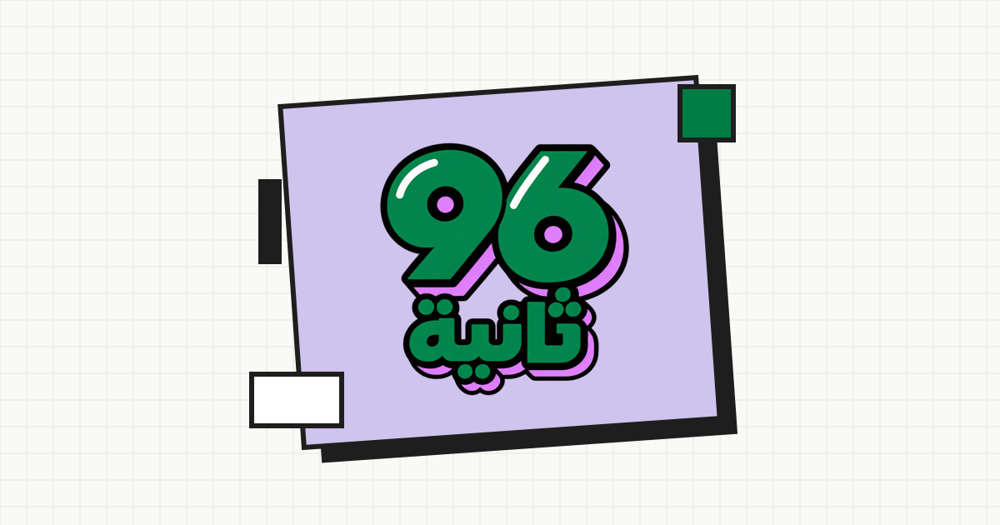

# 96 Seconds | 96 ثانية

**96 Seconds** is a fast-paced Arabic brain game created for Saudi National Day 96. Players have 96 seconds to solve as many varied mini-challenges as possible, build their streak, beat their personal best, and share their results with friends.

The project was built using an **agentic software development workflow** in less than 12 hours, with AI agents involved across ideation, UX design, implementation, testing, and deployment.

**96 ثانية** هي لعبة ذهنية عربية سريعة صُممت لليوم الوطني السعودي 96. أمام اللاعب 96 ثانية لحل أكبر عدد ممكن من التحديات المتنوعة، والمحافظة على سلسلة الإجابات الصحيحة، وتجاوز أفضل نتيجة شخصية، ثم مشاركة النتيجة مع الأصدقاء.

بُني المشروع عبر **منهجية تطوير برمجي تعتمد على وكلاء الذكاء الاصطناعي (Agentic Software Development)** خلال أقل من 12 ساعة، بمشاركة الوكلاء في صياغة الفكرة، وتصميم تجربة المستخدم، والتنفيذ، والاختبار، وحتى النشر.